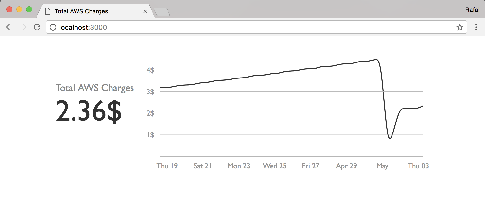

# 

[](http://www.serverless.com)

Expose AWS Cloudwatch Metrics as a public HTML page using AWS Lambda and server-side rendering, for free. Inspired by [Yan Cui's](https://github.com/theburningmonk) [concept](https://pbs.twimg.com/media/DXmrxJQXcAAGxGB.jpg:large) & [status.github.com](status.github.com)



## Demo

[Todo - my AWS account estimated charges](https://yvuuhi6gyg.execute-api.us-east-1.amazonaws.com/dev/)

## Usage
First, ensure that you have [Serverless Framework](serverless.com) installed. If not, install it:

```sh
$ npm install serverless -g
```

Clone the repo, install dependencies and deploy function:

```
$ git clone https://github.com/RafalWilinski/cloudwatch-public-metrics
$ npm install
$ npm run deploy
```

## Config
cloudwatch-public-metrics can be configured in two ways:

1. Using `config.yml` file:
```
METRIC_NAME: <Use "Namespace//MetricName" format e.g.: AWS/Billing//EstimatedCharges>   *required*
METRIC_TITLE: <Add custom title like: "Total AWS Charges">
METRIC_DURATION: <EndDate - StartDate e.g: "7 days">                                    *required*
METRIC_STATISTIC: <One of: ["Average", "Sum", "SampleCount", "Minimum", "Maximum"]>     *required*
METRIC_DIMENSIONS: <Comma separated array of Name=Value pair e.g.: "Currency=USD,InstanceId=123">
METRIC_SUFFIX: <For instance "%", "ms" or "$">
USAGE_PLAN: <Rate limiting configuration, see: https://serverless.com/framework/docs/providers/aws/guide/serverless.yml/>
```

2. Using CLI flags:
```sh
$ npm run deploy -- \
 --metricName AWS/Billing//EstimatedCharges \
 --metricTitle Estimated\ Charges \
 --metricDuration 15\ days \
 --metricStatistic Average \
 --metricDimensions Currency\=USD \
 --metricSuffix \$
```
## Development 

```sh
AWS_REGION=us-east-1 npm run watch
```

## License
MIT © [Rafal Wilinski](http://rwilinski.me)

### Credits
Logo by [Dinosoft Labs](https://thenounproject.com/dinosoftlabs/)
